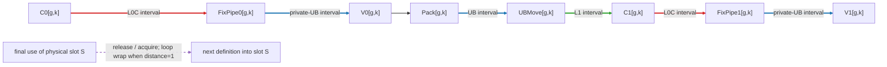

# CVSplit Scheduling Design

Status: production architecture implemented in this directory. Build, IR,
accuracy, and performance remain separate validation gates. The current
unified-SSA architecture has not yet produced a qualified hardware performance
result.

## 1. Architecture contract

CVSplit is one transactional compiler pass with five internal stages:

```text
PrepareSSA
  -> optional TableGen VFRewrite
  -> BuildSSAGraph
  -> ScheduleSSA
  -> SSABufferAndAllocate
```

The following rules define the implementation:

1. One canonical SSA graph carries semantic dependencies, resource ownership,
   virtual movement, schedule order, storage lifetimes, slot assignments, and
   reuse ownership. Scheduling and memory decisions are not reconstructed from
   a second graph.
2. `PrepareSSA`, and then the optional declarative VF rewrite, operate before
   graph construction. All later analysis and decisions use the same graph.
3. The graph represents four independent resources: Cube, FixPipe, Vector, and
   UBMove/MTE3.
4. Pack, FixPipe, and UBMove are virtual graph nodes. No CVSplit-owned physical
   buffer, transfer, scope, set, or wait is emitted until
   `SSABufferAndAllocate` has a complete valid plan.
5. The scheduler starts ready work on a resource as soon as dependencies and
   that resource permit. Greater reverse depth wins same-resource contention;
   source order is the deterministic tie breaker.
6. A publication `set` is emitted immediately after its concrete transfer. Its
   matching `wait` is emitted immediately before the first consumer.
7. One inclusive-lifetime allocator serves L0C, UB, and L1. The address spaces
   differ only in capacity and compatibility constraints.
8. Unsupported effects, recurrences, transfers, layouts, capacity states, or
   event states reject the candidate. The original IR remains unchanged.
9. VF algebraic rewrites are generated from TableGen patterns only.
10. CVSplit consumes a verified existing MIX input mapping. It does not silently
    reinterpret a pure 56-AIV launch as 28 MIX programs.

## 2. Transaction and stages

The pass clones the input module, runs all stages on the clone, verifies the
result, and commits only a complete valid candidate.

| Stage | Responsibility | Result |
|---|---|---|
| `PrepareSSA` | Select one supported innermost loop, prove structural preconditions, unroll by U2/U4/U8, and attach stable origin/lane identity. | Unrolled structured SSA; no physical CVSplit artifacts. |
| optional `VFRewrite` | Apply locally proven shaped-expression rewrites generated from `VFRewritePatterns.td`. | Equivalent SSA expressions; no scheduling or allocation choice. |
| `BuildSSAGraph` | Classify real operations, normalize supported destination-style SSA, build def-use and represented-memory edges, add virtual movement nodes, validate recurrences, and validate the supported two-AIV leading-row partition. | One acyclic canonical graph. |
| `ScheduleSSA` | Compute reverse depth, schedule ready nodes on four resources at their earliest legal levels, and record resource order. | The same graph with levels and order edges. |
| `SSABufferAndAllocate` | Derive inclusive lifetimes, assign physical slots and exact events, then lower virtual movement and form physical scopes. | Verified Cube/Vector MIX IR. |

An inapplicable clone is discarded. A completed candidate that violates an IR
invariant is a compiler error rather than a partial transformation.

## 3. Admission and safe fallback

The transaction accepts a loop only when the current implementation can model
all of its behavior:

- the function already carries a verified MIX launch mapping;
- one innermost loop has a static positive trip count that is greater than and
  exactly divisible by U2, U4, or U8;
- operations have static geometry required by the supported movement paths;
- the loop contains no semantic store, in-place mutation, or unknown memory
  effect;
- every loop-carried value remains on one resource; there is no Cube-to-Vector
  or Vector-to-Cube recurrence across loop iterations;
- each represented loop-local load buffer is a static fresh allocation with
  exactly one in-loop copy writer from a source traceable to a function
  argument, one or more in-loop tensor readers, no other uses, and writer
  before reader order;
- cross-resource values match a supported transfer edge; and
- the selected static leading-row partition is retileable through every
  affected Vector value and output store.

The no-store and no cross-resource recurrence gates deliberately avoid hidden
cross-iteration memory and SSA edges. Same-resource recurrences retain their
ordinary SSA order. Physical slot reuse across loop iterations is modeled
separately through loop-wrap ownership.

The represented-load condition proves only the local destination's
write-before-read relation; `BuildSSAGraph` records that relation as an
explicit edge because it is not an SSA def-use edge. It does not prove
arbitrary source-pointer stability or cross-iteration aliasing. Per-lane
address calculations remain ordinary SSA after standard SCF unrolling.

The AIV condition is also deliberately narrow. The pass derives an even,
static dimension-0 split from a rank-two Cube-to-Vector tile, accepts only
supported row-preserving Vector operations and dense contiguous output views,
and later constructs half-row output views at
`old_offset + sub_block_id * (rows / 2) * row_stride`. Under the existing
two-AIV MIX contract, sub-block IDs 0 and 1 therefore address adjacent,
nonoverlapping halves. This is not general region or alias analysis for
arbitrary AIV address expressions.

Any failed condition returns `NotApplicable` and preserves the input module
byte-for-byte with respect to CVSplit.

## 4. Canonical SSA graph

Each graph node has one resource, stable source order, predecessors,
successors, reverse depth, and scheduled level. The graph contains:

- real Cube and Vector operations;
- virtual Vector Pack nodes;
- virtual FixPipe nodes;
- virtual UBMove/MTE3 nodes;
- ordinary SSA def-use edges, which remain SSA when producer and consumer use
  the same engine;
- explicit copy-to-reader edges for admitted represented local loads;
- transfer source and destination edges;
- per-resource order edges added by `ScheduleSSA`; and
- per-slot ownership edges added by `SSABufferAndAllocate`.

Classification is part of `BuildSSAGraph`; it is not a separate scheduling or
buffer-analysis pipeline. Every real operation must have one supported owner.

### 4.1 Supported Cube-to-Vector path

```text
Cube computation -> L0C value -> virtual FixPipe -> UB value -> Vector consumer(s)
```

The supported producer is a static rank-two matrix result. Physical lowering
binds it to L0C and publishes it through row-split FixPipe into the validated
private-UB halves of the two AIVs.

The L0C lifetime begins at Cube definition and includes the FixPipe read. The
UB lifetime begins at the same transfer level and ends at the final Vector use.
Because both intervals include the transfer level, source and destination
storage cannot alias at that level.

### 4.2 Supported Vector-to-Cube path

```text
Vector computation -> UB value -> virtual Pack -> virtual UBMove/MTE3
                   -> L1 value -> Cube consumer(s)
```

The value is packed on Vector, copied from UB to L1 by UBMove/MTE3, and consumed
as a supported Cube matrix input. The UB lifetime includes the copy read; the
L1 lifetime begins at the copy level and ends at the final Cube use.

### 4.3 Unsupported paths

The pass rejects fan-out or movement requiring an unimplemented edge, including
an unsupported source/destination address space, transfer unit, layout,
packing, alias relation, or repeated publication. It does not guess a transfer
or allow downstream bufferization to invent one.

This explicit allowlist can be extended later with new graph-edge semantics.
The fallback remains the original IR until the new edge has complete lifetime,
movement, synchronization, and verification support.

## 5. `ScheduleSSA`

Before scheduling, a leaf is a canonical graph node with no zero-distance
successor. `scf.yield` is structural and is not a graph node. Virtual Pack,
FixPipe, and UBMove nodes and the local-use-before-Pack constraints participate
in this DAG; later resource-order and storage-ownership edges do not.

Reverse depth is the longest remaining dependency path to any reachable leaf:

```text
reverse_depth(leaf) = 0
reverse_depth(node) = 1 + max(reverse_depth(successor))
```

If a node reaches several leaves, the pass takes the maximum path length, not
the sum, average, or number of leaves. For path lengths 3, 5, and 2, the node's
reverse depth is 5. This is an unweighted edge-count heuristic rather than a
latency estimate.

At each logical level, the scheduler selects at most one ready node for each
of Cube, FixPipe, Vector, and UBMove/MTE3. The only scheduling policy is:

1. execute ready work on each free resource as soon as possible;
2. when several nodes contend for one resource, choose greater reverse depth;
3. break an equal-depth tie by source order, then stable node identity.

All selections for a level are made before their successors become ready. A
producer and its consumer therefore occupy different levels, while independent
work on different resources may share a level. The chosen per-resource order
is written back to the canonical graph.

Virtual transfer nodes make movement independently schedulable. FixPipe can
start as soon as its Cube value is ready, including while the next Cube node
runs. UBMove/MTE3 can start after Pack while later Vector work runs.

### 5.1 Representative dynamic steady state for U4

`ScheduleSSA` assigns levels to one unrolled U4 body. After lowering, Cube and
Vector own separate repeated loops. The table expands two consecutive
executions of that body to show the resulting dynamic steady state. Its rows
are logical issue slots, not hardware cycles, and iteration `g+1` is not added
to the stored intra-body graph. Cross-period physical-slot reuse is protected
by distance-one ownership events.

For lane `k`, the representative dependency chain is
`C0[k] -> F0[k] -> V0[k] -> U0[k] -> C1[k] -> F1[k] -> V1[k]`.

| Slot | Cube | FixPipe | Vector | UBMove/MTE3 |
|---:|---|---|---|---|
| 0 | `C0[g,0]` |  |  |  |
| 1 | `C0[g,1]` | `F0[g,0]` |  |  |
| 2 | `C0[g,2]` | `F0[g,1]` | `V0[g,0]` |  |
| 3 | `C0[g,3]` | `F0[g,2]` | `V0[g,1]` | `U0[g,0]` |
| 4 | `C1[g,0]` | `F0[g,3]` | `V0[g,2]` | `U0[g,1]` |
| 5 | `C1[g,1]` | `F1[g,0]` | `V0[g,3]` | `U0[g,2]` |
| 6 | `C1[g,2]` | `F1[g,1]` | `V1[g,0]` | `U0[g,3]` |
| 7 | `C1[g,3]` | `F1[g,2]` | `V1[g,1]` |  |
| 8 | `C0[g+1,0]` | `F1[g,3]` | `V1[g,2]` |  |
| 9 | `C0[g+1,1]` | `F0[g+1,0]` | `V1[g,3]` |  |
| 10 | `C0[g+1,2]` | `F0[g+1,1]` | `V0[g+1,0]` |  |
| 11 | `C0[g+1,3]` | `F0[g+1,2]` | `V0[g+1,1]` | `U0[g+1,0]` |

Iteration `g+1` starts on Cube in slot 8 while FixPipe and Vector drain
iteration `g`. It cannot start in slot 7 in this example because `C1[g,3]`
already occupies Cube, and the scheduler permits at most one node per resource
in a slot. Publication is placed after each transfer; readiness waits are
placed immediately before the first consumer. Reused remote slots additionally
carry release/acquire ownership, including a loop-wrap credit from the final
interval in `g` to the first interval in `g+1`.

### 5.2 Transfer edges and storage lifetimes



| Edge | Meaning |
|---|---|
| red | L0C lifetime: Cube definition through the FixPipe read, or through a later direct Cube consumer |
| blue | UB lifetime: FixPipe publication through the final Vector use, or Vector/Pack definition through the UBMove read |
| green | L1 lifetime: UBMove publication through the final Cube use |
| purple dashed | ownership release/acquire before the same physical slot is overwritten; a loop-wrap edge has iteration distance one |
| ordinary SSA edge | same-engine value; scheduling may reorder independent operations, but CVSplit creates no transfer buffer or event |

After allocation, an actual plan can annotate distinct nonoverlapping intervals
with the same slot ID to show physical reuse. Source and destination intervals
both include the transfer slot, so they cannot alias at that slot.

## 6. Inclusive lifetimes and unified allocation

Each transported value receives an inclusive interval `[definition level,
last-use level]`. Two intervals overlap when one begins at the level where the
other ends. This models a transfer reading its source while writing its
destination.

| Value segment | Address space | Inclusive lifetime |
|---|---|---|
| Cube definition to FixPipe completion or later direct Cube use | L0C | Cube definition through final L0C consumer |
| FixPipe publication to final Vector use | UB | FixPipe level through final Vector consumer |
| Vector/Pack definition to UBMove completion | UB | Vector definition through MTE3 read completion |
| UBMove publication to final Cube use | L1 | MTE3 level through final Cube consumer |

One generic greedy allocator runs independently for L0C, UB, and L1:

1. process requests by definition level, end level, and stable identity;
2. mark a prior interval reusable only when `prior.end < current.begin`;
3. preserve two slots when consecutive requests overlap or the scheduled graph
   has no ordering path from the preceding final use to the next definition;
4. after required pipeline depth exists, create another compatible slot while
   capacity permits without consuming capacity reserved for remaining required
   slots;
5. when another slot cannot be created, reuse the compatible free slot whose
   preceding interval ended earliest, with physical slot identity as the final
   tie breaker;
6. reject when neither creation nor safe reuse is possible, or when the plan
   exceeds address-space or sixteen-block-event capacity.

Original loop-local load materializations participate in the same capacity
decision. A graph-proven allocation/copy/read chain contributes its scheduled
peak live bytes. An allocation with ambiguous users or lifetime contributes
its full size for the complete region. L0C, UB, and L1 do not have separate
reuse heuristics; only their capacity, alignment, and type compatibility differ.

## 7. Exact synchronization

Synchronization is derived after the schedule and slot plan are complete.

### Readiness

Each physical publication has exact producer and first-consumer endpoints:

- Cube-to-Vector: movement completes on FixPipe, then `set`; Vector executes
  `wait` immediately before the first consumer.
- Vector-to-Cube: movement completes on UBMove/MTE3, then `set`; Cube executes
  `wait` immediately before the first consumer.

Later users of the same materialization do not receive redundant readiness
waits. An event ID may be reused only when the graph proves the prior endpoint
pair is complete before the next `set`.

### Slot ownership

When two intervals reuse one physical slot, that slot receives an ownership
edge from the previous final use to the next definition. Cross-pipeline reuse
receives an exact release/acquire event for that transition. Same-pipeline
reuse retains its resource-order dependency.

Periodic reuse across loop iterations receives a loop-wrap ownership relation:
the first definition waits for ownership, the last use releases it, and the
initial credit is seeded once before repeated use.
Each transfer gets one readiness block event. A reused remote physical slot
gets one ownership block event shared by that slot's release/acquire
transitions. A distance-one relation is seeded once before the first loop
execution; subsequent iterations pass the ownership credit from final use to
the next definition. Same-engine reuse emits no CVSplit ownership event and
remains an ordering relation for downstream lowering.

Event capacity is a target resource. Exhaustion rejects the candidate before
any physical IR is committed.

## 8. Final lowering and MIX mapping

Only `SSABufferAndAllocate` emits physical artifacts. It:

- allocates the selected L0C, UB, and L1 slots;
- binds matrix destinations to planned L0C slots;
- lowers virtual FixPipe and UBMove nodes to concrete movements;
- replaces supported cross-resource uses with tensors backed by planned slots;
- emits exact readiness and ownership synchronization;
- creates one Cube scope and one Vector scope;
- maps the validated restricted leading-row halves to the two AIV subblocks;
- verifies the complete module before commit.

The input must already represent a valid MIX launch. CVSplit preserves its
external program-grid contract and schedules the body inside each MIX group.
Pure-Vector-to-MIX conversion is a separate design problem.

## 9. VF rewrite boundary

`VFRewritePatterns.td` is the sole source of VF algebraic patterns. Generated
patterns may change a local expression only when semantic, type, and shape
equivalence is proven. They do not choose the unroll factor, resource owner,
schedule, transfer, slot, event, or launch mapping. The graph stages handle
those decisions after rewriting.

## 10. Implementation map

| File | Responsibility |
|---|---|
| `CVSplitScheduling.cpp` | Clone, run the five stages, verify, and commit. |
| `PreCheck.cpp` | `PrepareSSA`: admission, lineage tags, and unrolling. |
| `VFRewritePatterns.td`, `VFRewrite.cpp` | Optional generated VF rewrites. |
| `classifyAllOps.cpp` | `BuildSSAGraph`: classification, supported SSA normalization, graph construction, transfer allowlist, recurrence gate, and restricted AIV-partition validation. |
| `DependencyScheduler.cpp` | `ScheduleSSA`: reverse-depth, resource-ASAP scheduling, and order edges. |
| `SSAToBufferAllocation.cpp`, `include/CVSplitScheduling/BufferSlotPlan.h` | `SSABufferAndAllocate`: intervals, generic slots, events, concrete movement, partitioning, and scopes. |
| `Pipeline.h` | Canonical graph and internal-stage interfaces. |

At commit `17dc49065eec3f748964c784e8f8b2aaa03fb455`, the feature adds 3,988
implementation/header/TableGen lines and 67 build/backend/binding integration
lines. Tests, documentation, and generated files are excluded. This is a
source-size inventory, not a correctness or performance claim.

## 11. Validation and performance evidence

Qualification requires, in order:

1. a clean build and positive/fallback IR tests;
2. all 11 established FA shapes accuracy-gated with isolated caches; and
3. a per-shape matched AscendC comparison for all 11 shapes using identical
   source, harness, toolchain, card, launch mapping, profiler, and cache policy,
   preferably in an A/B/A bracket. An aggregate is published only after all 11
   rows pass these gates.

The preserved `cvss_4_post_split_materialize` experiment is historical context,
not current unified-SSA evidence:

| Result | Meaning |
|---|---|
| `89.299%` of AscendC | Historical arithmetic combining a 2026-09-07 card-7 CVSplit run with a 2026-08-30 card-3 AscendC run. It is an unmatched mixed-card/mixed-date observation. |
| `81.314502%` of AscendC | Authoritative fresh matched average-time ratio for HD64/CTX32768 on card 0. The named post-split materializer fell back for this shape (`64 != 128`), so this is not evidence that materialization improved the kernel. |
| Current unified-SSA architecture | Not yet measured on qualified hardware. No percentage is claimed. |

The canonical provenance, hashes, raw paths, and correction are recorded in
`C:\codexWS\ASCEND_INFRASTRUCTURE_AND_HARDWARE_RUNBOOK.md`, section
“Historical post-split-materializer replay and 89% claim correction
(2026-09-12)”.
